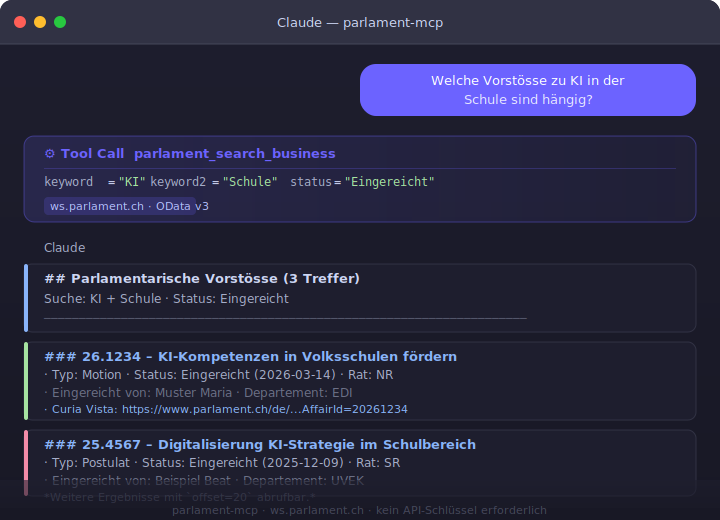

[🇬🇧 English Version](README.md)

# 🏛️ parlament-mcp

[](https://github.com/malkreide/parlament-mcp/actions/workflows/ci.yml)
[](https://badge.fury.io/py/parlament-mcp)
[](LICENSE)
[](https://github.com/malkreide)

> **Teil des [Swiss Public Data MCP Portfolio](https://github.com/malkreide)** –
> KI-Modelle mit Schweizer Öffentlichkeitsdaten verbinden.

Ein MCP-Server, der KI-Modelle mit dem **Schweizer Bundesrat und Bundesversammlung** verbindet –
über die [Curia Vista OData-API](https://ws.parlament.ch/odata.svc/) (`ws.parlament.ch`).
Zugriff auf Vorstösse, Abstimmungen, Ratsmitglieder, Sessionen und Debatten-Transkripte –
**ohne API-Schlüssel** (Phase 1 – No-Auth-First).

---

## 🎯 Anker-Demo-Abfrage

> *«Welche Vorstösse zu KI in der Schule sind hängig?»*
> → `parlament_search_business(keyword="KI", keyword2="Schule", status="Eingereicht")`

Ideal für die **KI-Fachgruppe Stadtverwaltung Zürich**: Offene Vorstösse zu KI in der Bildung,
Digitalisierungsinitiativen oder beliebigen Politikthemen – sofort abrufbar.

<p align="center">
  
</p>

---

## 🔧 Tools

| Tool | Beschreibung |
|---|---|
| `parlament_search_business` | Vorstösse nach Stichwort, Typ, Status, Rat, Datum suchen |
| `parlament_get_business` | Vollständige Details eines Vorstosses (Texte, BR-Antwort) |
| `parlament_search_members` | Ratsmitglieder nach Kanton (z.B. ZH), Partei, Rat finden |
| `parlament_get_votes` | Parlamentarische Abstimmungen mit Ja/Nein-Bedeutung |
| `parlament_get_sessions` | Aktuelle Sessionen mit IDs für Folgeabfragen |
| `parlament_get_transcripts` | Debatten-Auszüge nach Stichwort oder Redner (Amtliches Bulletin) |

---

## 🏗️ Architektur

```
┌──────────────────────────────────┐
│     MCP-Host (Claude Desktop /   │
│     Claude API / IDE)            │
└─────────────┬────────────────────┘
              │ MCP-Protokoll (JSON-RPC 2.0)
              │ Transport: stdio (lokal) / SSE (Cloud)
┌─────────────▼────────────────────┐
│         parlament-mcp            │
│   FastMCP · Python · Pydantic v2 │
└─────────────┬────────────────────┘
              │ HTTPS / OData v3
┌─────────────▼────────────────────┐
│  ws.parlament.ch / odata.svc     │
│  Curia Vista – Kein Auth nötig   │
│                                  │
│  Business · Vote · MemberCouncil │
│  Session · Transcript · ParlGroup│
└──────────────────────────────────┘
```

---

## 🚀 Installation

### Claude Desktop (stdio)

Ergänze `~/Library/Application Support/Claude/claude_desktop_config.json`:

```json
{
  "mcpServers": {
    "parlament": {
      "command": "uvx",
      "args": ["parlament-mcp"]
    }
  }
}
```

Claude Desktop neu starten – fertig.

### Lokale Entwicklung

```bash
git clone https://github.com/malkreide/parlament-mcp
cd parlament-mcp
pip install -e .
python -m parlament_mcp.server
```

### Cloud / Railway (SSE)

```bash
MCP_TRANSPORT=sse PORT=8080 python -m parlament_mcp.server
# SSE-Endpunkt: http://dein-host:8080/sse
```

---

## 💡 Beispielabfragen

**KI und Schule – offene Vorstösse:**
```
parlament_search_business(keyword="Künstliche Intelligenz", keyword2="Bildung", status="Eingereicht")
```

**Alle Zürcher Ratsmitglieder:**
```
parlament_search_members(canton="ZH", active_only=True)
```

**Wie hat der Rat über Bildungsdigitalisierung abgestimmt?**
```
parlament_get_votes(keyword="Digitalisierung")
```

**Was hat Nationalrätin X zum Thema KI gesagt?**
```
parlament_get_transcripts(speaker_name="Müller", keyword="KI")
```

---

## 🔗 Synergien im Portfolio

| Partner-Server | Kombination |
|---|---|
| [`fedlex-mcp`](https://github.com/malkreide/fedlex-mcp) | Gesetzestext ↔ parlamentarische Debatte, die ihn geschaffen hat |
| [`zurich-opendata-mcp`](https://github.com/malkreide/zurich-opendata-mcp) | Städtische Daten ↔ kantonale/nationale Vorstösse |
| [`swiss-statistics-mcp`](https://github.com/malkreide/swiss-statistics-mcp) | Statistiken ↔ Vorstösse, die sich darauf beziehen |

**Power-Query-Beispiel:**
```
«Zeig mir alle Zürcher Vorstösse zu KI in der Bildung
 und verlinke die relevanten Bundesgesetze aus fedlex-mcp.»
```

---

## 📊 Datenquelle

- **API:** [ws.parlament.ch/odata.svc](https://ws.parlament.ch/odata.svc/)
- **Authentifizierung:** Keine (Phase 1 – No-Auth-First)
- **Protokoll:** OData v3 / JSON
- **Abdeckung:** Alle Parlamentsgeschäfte seit 1978; Abstimmungen und Transkripte
- **Aktualisierung:** Echtzeit (offizieller Datendienst des Bundes)

---

## 🛡️ Safety & Limits

| Aspekt | Details |
|--------|---------|
| **Zugriff** | Nur lesend (`readOnlyHint: true`) — der Server kann keine Daten ändern oder löschen |
| **Personendaten** | Parlamentsgeschäfte sind öffentliche Amtshandlungen (BGÖ). Es werden keine privaten Daten abgerufen oder gespeichert. |
| **Rate Limits** | Eingebaute Obergrenzen pro Abfrage: max. 100 Treffer (Geschäfte/Mitglieder), 50 (Abstimmungen/Transkripte), 10 (Sessionen) |
| **Timeout** | 20 Sekunden pro API-Aufruf |
| **Authentifizierung** | Keine API-Keys nötig — Curia Vista ist öffentlich zugänglich |
| **Datenquelle** | Offizieller Datendienst des Bundes (Schweizerische Parlamentsdienste) |
| **Nutzungsbedingungen** | Es gelten die ToS von [ws.parlament.ch](https://ws.parlament.ch/) — Schweizerische Parlamentsdienste |

---

## Bekannte Einschränkungen

- OData `substringof()`-Filter unterscheidet Gross-/Kleinschreibung bei manchen Feldern
- Transkript-Volltextsuche kann bei sehr breiten Abfragen langsam sein (`limit` verwenden)
- Session-Namen können für sehr aktuelle Sessionen `null` sein – stattdessen Session-ID nutzen
- Derzeit nur Sprache `DE` vollständig getestet (`FR`, `IT` verfügbar)

---

## Mitwirken

Siehe [CONTRIBUTING.md](CONTRIBUTING.md).

---

## Lizenz

MIT © [malkreide](https://github.com/malkreide)
